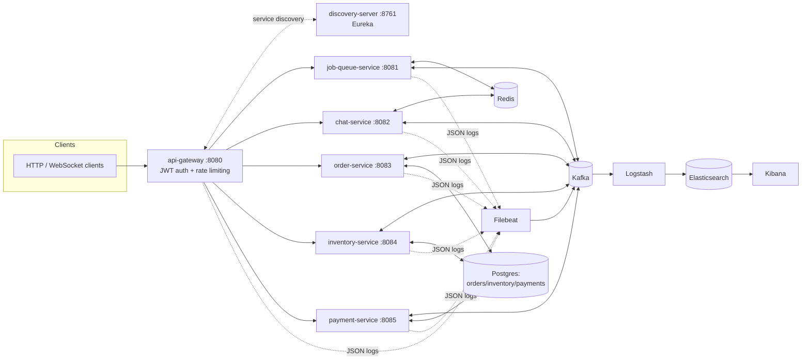

# Distributed Systems Platform

A single runnable platform demonstrating five distributed-systems patterns commonly used (I think), built as one cohesive Spring Boot + Kafka + Redis +
Postgres + ELK + Kubernetes system rather than five disconnected toy repos:

1. **[Job Queue](#1-job-queue-servicejob-queue-service)** — Redis + Kafka priority queue with retries, exponential backoff, and a dead-letter queue.
2. **[Real-Time Chat](#2-real-time-chatchat-service)** — Kafka + Redis pub/sub, designed to scale to 10k+ concurrent WebSocket users.
3. **[Event-Driven Checkout](#3-event-driven-checkout-saga)** — Kafka choreographed Saga with compensating transactions across 3 services.
4. **[Microservices + API Gateway](#4-microservices--api-gateway)** — Eureka service discovery, JWT auth, Redis-backed rate limiting, deployed on Kubernetes.
5. **[Log Aggregation](#5-log-aggregation)** — every service's structured logs flow through Kafka into ELK.

Plus a [load-testing suite](#load-testing) (Locust + JMeter) that exercises all five and
reports throughput, p95/p99 latency, and error rate.

## Architecture



See [docs/architecture.md](docs/architecture.md) for a per-project diagram and deeper
explanation of each design.

## Quick start

Prerequisites: **Docker Desktop** (or any Docker + Compose v2). You do **not** need Java
or Maven installed locally — every service builds inside its own multi-stage Docker
build.

```bash
docker compose up --build
```

First build takes a while (pulls Kafka/Postgres/Elasticsearch/Kibana images and compiles
8 Maven modules). Once it settles:

| Service | URL |
|---|---|
| API Gateway | http://localhost:8080 |
| Eureka dashboard | http://localhost:8761 |
| Job Queue (direct) | http://localhost:8081 |
| Chat (direct) | http://localhost:8082 |
| Order / Inventory / Payment (direct) | :8083 / :8084 / :8085 |
| Kafka UI | http://localhost:8090 |
| Kibana | http://localhost:5601 |
| Elasticsearch | http://localhost:9200 |

Log in through the gateway to get a JWT (demo users — see `services/api-gateway`):

```bash
curl -X POST http://localhost:8080/auth/login \
  -H 'Content-Type: application/json' \
  -d '{"username":"alice","password":"password123"}'
# => {"token": "..."}

curl http://localhost:8080/api/jobs/dlq -H 'Authorization: Bearer <token>'
```

## 1. Job Queue (`services/job-queue-service`)

Kafka can't express message priority natively, so this implements the standard
**"topic-per-priority + pause/resume consumer"** pattern: `jobs.high` / `jobs.medium` /
`jobs.low` topics, and a single consumer that pauses/resumes partitions each cycle to
always drain HIGH before MEDIUM before LOW. Job state lives in Redis (hash per job);
failures are retried with **exponential backoff** (tracked in a Redis sorted set,
requeued by a `@Scheduled` poller) up to a configurable max, after which the job is
moved to a **dead-letter queue** (`jobs.dlq` topic + a Redis set) and can be replayed.

```bash
curl -X POST http://localhost:8081/api/jobs -H 'Content-Type: application/json' \
  -d '{"type":"send-email","payload":"hi","priority":"HIGH","maxRetries":5}'
curl http://localhost:8081/api/jobs/{id}
curl http://localhost:8081/api/jobs/dlq
curl -X POST http://localhost:8081/api/jobs/dlq/{id}/replay
```

## 2. Real-Time Chat (`services/chat-service`)

Plain WebSocket (`/ws/chat/{roomId}`) fanned out across stateless replicas via **Redis
Pub/Sub** — no sticky sessions needed, since every instance subscribes to every room and
forwards to whichever local sockets it holds. Kafka (`chat.messages`, keyed by roomId)
gives a durable, ordered history/audit trail independent of the low-latency Redis path.
See [services/chat-service/README.md](services/chat-service/README.md) for the full
design writeup and manual test steps.

## 3. Event-Driven Checkout (Saga)

A **choreographed Saga** across three independent services with a real compensating
transaction — no orchestrator, no synchronous REST calls between them, purely Kafka
events:

```
order-service --order.created--> inventory-service --inventory.reserved--> payment-service
      ^                                  |  ^                                    |
      |                          inventory.failed                        payment.completed
      |                                  |                                       |
      +-------------- order CANCELLED <--+                     order CONFIRMED <-+
      |
      +--payment.failed--> order CANCELLED --inventory.compensate--> inventory-service
                                                                      (releases stock)
```

```bash
curl -X POST http://localhost:8083/orders -H 'Content-Type: application/json' \
  -d '{"customerId":"cust-1","itemId":"sku-1","quantity":1,"amount":29.99}'
curl http://localhost:8083/orders/{id}   # poll to watch it settle to CONFIRMED/CANCELLED
curl http://localhost:8084/inventory/sku-1
```

Both inventory reservation and payment charging inject a small random failure rate on
purpose, so the compensation path is actually observable under normal load, not just at
true stock exhaustion.

## 4. Microservices + API Gateway

- **Service discovery**: `discovery-server` (Eureka); every service registers itself and
  the gateway resolves routes via `lb://<service-id>` client-side load balancing.
- **Auth**: `POST /auth/login` on the gateway issues an HS256 JWT; a global filter
  rejects any other request without a valid `Authorization: Bearer` token and forwards
  the caller's identity downstream as `X-User-Id`.
- **Rate limiting**: Redis-backed token bucket (`RequestRateLimiter`) on the job-queue
  and order routes.
- **Kubernetes**: full manifests in `k8s/` — namespace, infra (Kafka/Redis/Postgres),
  one Deployment+Service+HPA per application service, and an Ingress. See
  [Running on Kubernetes](#running-on-kubernetes) below.

## 5. Log Aggregation

Every service logs structured JSON to stdout (`logstash-logback-encoder`, shared via
`services/common`'s `logback-json-base.xml`). **Filebeat** autodiscovers each container
and ships lines into a Kafka topic (`app-logs`) — Kafka is the buffer that absorbs
bursty/high-volume log traffic ("millions of logs/day") without back-pressuring the
services themselves. **Logstash** consumes that topic, parses it, and indexes into
**Elasticsearch**; **Kibana** is where you'd search/dashboard it. Config lives in
`logging/`. Generate volume by running the load tests below, then explore it at
http://localhost:5601.

## Load testing

`load-tests/` has both **Locust** and **JMeter** suites — see
[load-tests/README.md](load-tests/README.md) for exact commands. In short:

| Tool | Target | What it measures |
|---|---|---|
| Locust | Job Queue (`POST /api/jobs`) | throughput, p95/p99, error rate |
| Locust | Chat (WebSocket round-trip) | latency at up to 10k+ concurrent connections |
| JMeter | Job Queue (`POST /api/jobs`) | throughput, p90/p95/p99, error % (Aggregate Report) |
| JMeter | Checkout Saga (`POST /orders` → poll) | throughput, latency, saga consistency under load |

## Running on Kubernetes

The manifests expect each image already built locally as `distributed-systems-platform/<service>:latest`
with `imagePullPolicy: IfNotPresent` (no registry push needed for a local cluster). Build
them all, then load them into your cluster's image store:

```bash
for svc in discovery-server api-gateway job-queue-service chat-service order-service inventory-service payment-service; do
  docker build -t distributed-systems-platform/$svc:latest -f services/$svc/Dockerfile .
done

# minikube: make those images visible to the cluster's own Docker daemon
minikube image load distributed-systems-platform/discovery-server:latest
# ...repeat per service, or use `minikube image load $(docker images -q ...)`-style scripting.
# kind: `kind load docker-image distributed-systems-platform/<service>:latest`
```

```bash
kubectl apply -f k8s/00-namespace.yaml
kubectl apply -f k8s/infra/
kubectl apply -f k8s/discovery-server/ -f k8s/api-gateway/ -f k8s/job-queue-service/ \
               -f k8s/chat-service/ -f k8s/order-service/ -f k8s/inventory-service/ \
               -f k8s/payment-service/
kubectl apply -f k8s/ingress.yaml   # requires an ingress controller, e.g.
                                     # `minikube addons enable ingress`
```

Each application Deployment has a HorizontalPodAutoscaler (CPU-based) and readiness/
liveness probes wired to Spring Boot's actuator health groups (auto-enabled when running
in a cluster). Note: the infra manifests (`k8s/infra/`) run single-replica Kafka/Redis/
Postgres for demo purposes — a real deployment would use an operator (Strimzi for Kafka,
a managed Postgres, etc.) for proper HA, which is out of scope for this portfolio repo.
The ELK stack is provided via `docker-compose.yml` only (not k8s) for the same reason —
running it well on k8s really wants the Elastic operator/Helm chart.

## Repo layout

```
services/            8 Spring Boot modules (Maven reactor, see root pom.xml)
  common/             shared: ApiError, Kafka topic constants, JSON logging config
  discovery-server/   Eureka
  api-gateway/        Spring Cloud Gateway: auth, rate limiting, routing
  job-queue-service/  project 1
  chat-service/       project 2
  order-service/
  inventory-service/  project 3 (saga participants)
  payment-service/
k8s/                  Kubernetes manifests (namespace, infra, one dir per service)
logging/              Filebeat + Logstash config for project 5
load-tests/           Locust + JMeter suites for all five projects
docs/architecture.md  per-project diagrams and design notes
docker-compose.yml    brings up the entire platform locally
```
