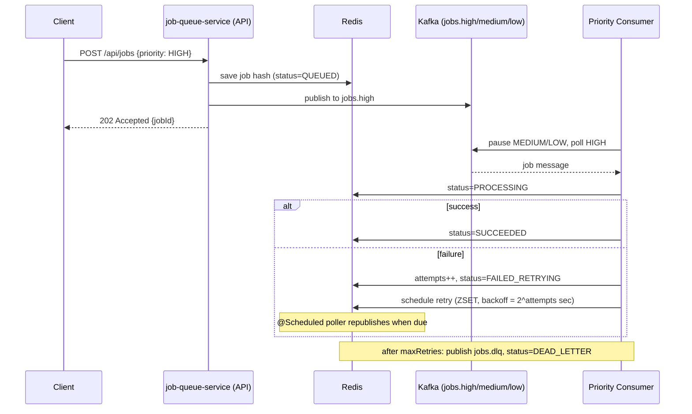
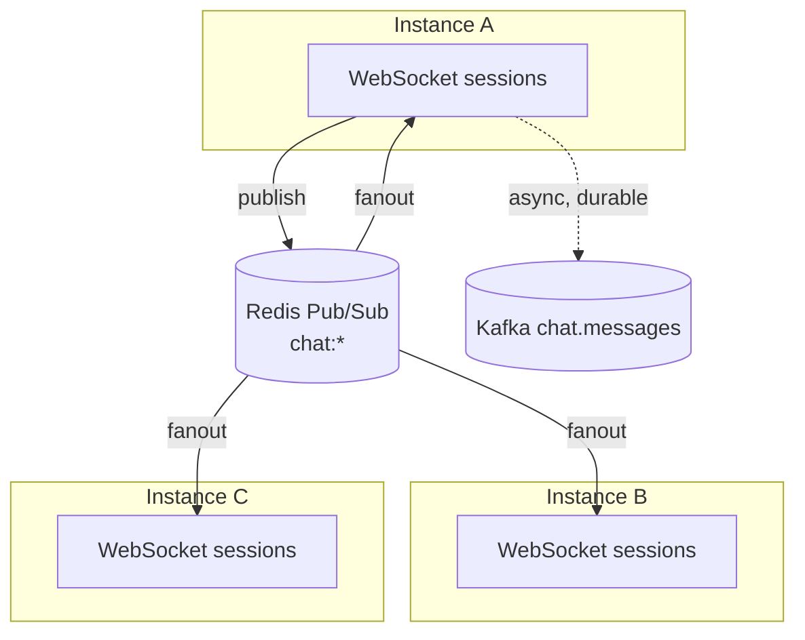
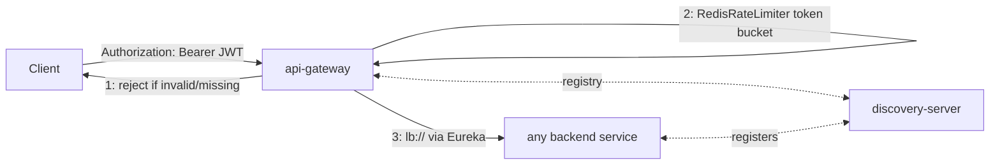
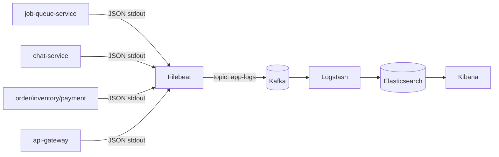

# Architecture Notes

Deeper per-project design notes than the root README. Read that first for the quick
start; this is for when you (or an interviewer) want to go one level deeper.

## 1. Job Queue

**Why topic-per-priority + pause/resume, not a single topic with a priority field?**
Kafka guarantees ordering only within a partition, and a consumer reading a single topic
has no way to "skip ahead" to a higher-priority message that arrives later in the log.
Splitting by topic and having the consumer explicitly pause low-priority partitions
whenever higher-priority ones might have work is the standard way to get priority
semantics out of a broker that doesn't natively support it.

## 2. Real-Time Chat

No sticky sessions, no shared session table — each instance only knows about the sockets
*it* holds. Redis Pub/Sub is the fanout layer that makes "which instance received the
message" independent from "which instances hold the recipients' sockets," which is what
lets you add replicas linearly to hold more concurrent connections. Kafka is a parallel,
independent path purely for durability/audit/replay — losing it doesn't affect live
delivery.

## 3. Event-Driven Checkout (Saga)

See the root README for the full event flow diagram. Design notes:

- **Choreography, not orchestration**: no central saga coordinator; each service reacts
  to events and decides its own next action (including compensation). This trades
  central visibility for looser coupling — a fourth participant could be added without
  touching the other three, as long as it speaks the same event contract.
- **No synchronous calls between saga participants** — everything is Kafka events, which
  is what "event-driven" means here. `amount` is threaded through `order.created` →
  `inventory.reserved` → payment-service purely so payment-service never needs to call
  back to order-service to find out what to charge.
- **Compensating transaction**: inventory is reserved optimistically before payment is
  attempted. If payment fails, `inventory.compensate` releases the reservation — this is
  the crux of the Saga pattern (eventual consistency via compensation, since there's no
  distributed transaction spanning three independent databases).
- Both inventory-service and payment-service inject a small simulated failure rate so
  the compensation path is exercised under normal load testing, not only at genuine
  stock exhaustion.

## 4. Microservices + API Gateway

Three concerns, each independently swappable: **auth** (JWT validation, a global
filter), **rate limiting** (Redis token bucket, per-route), **discovery/routing**
(Eureka + client-side load balancing via `lb://`). None of the backend services need to
know about each other's network location — they just register a name.

## 5. Log Aggregation

Kafka sits between log collection (Filebeat) and log indexing (Logstash → Elasticsearch)
specifically so a burst of log volume (a traffic spike, a noisy failure loop) queues up
in Kafka rather than overwhelming Elasticsearch's indexing rate or blocking the
application containers' own I/O — the same "durable buffer decouples producer and
consumer rates" idea as the job queue and chat projects, applied to observability
infrastructure instead of business events.
